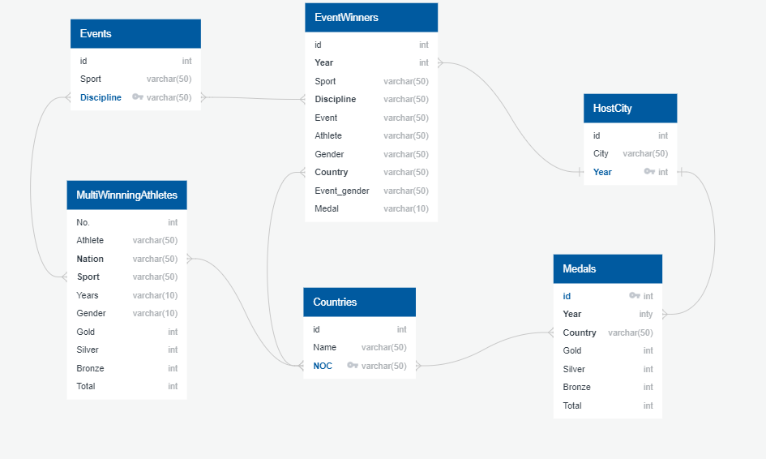

# **ETL Olympic Committee**
Our project plans to gather data for an athletics sportswear company.  We plan to look at Summer Olympics Data from 2021 as well as from previous summer olympics. We will create a database using medal count, country, athlete, and sport event data.

---
## Table of Contents
- [Group Members](https://github.com/sammyschapps87/Data_Olympics_proj_2/blob/main/README.md#group-members)
- [Questions to Ask]https://github.com/sammyschapps87/Data_Olympics_proj_2#questions-to-ask
- [Data Sources]Data Sources
    [CSV]
    [HTML]
- [ETL Process]
    1. [Extraction]
    2. [Transformations]
    3. [Load]

---
## Group Members
- Saleha Ahmed
- Sam Schappel
- Brian Johnson
- Vasav Dave
- Tinu Adepoju

---
## Questions to Ask 
1. What athletes have the most medals? 
2. What countries performed the best and which sport/event?
3. What event/sport is most popular in the US?

---
## Data Sources
#### CSV

    - https://www.kaggle.com/divyansh22/summer-olympics-medals
    - https://www.kaggle.com/berkayalan/2021-olympics-medals-in-tokyo
    - https://www.kaggle.com/arjunprasadsarkhel/2021-olympics-in-tokyo 

#### HTML
    - https://en.wikipedia.org/wiki/List_of_multiple_Olympic_gold_medalists
---
## ETL Process

#### 1. Extraction
- To create our host city table the large data set containing olympic data from 1976 - 2008 was filtered to only show which city hosted the olympics and when. In order to do this the csv file was read into pandas and cleaned to only give values for the variables City and Year. After this na values were dropped as well as all duplicate rows (there were a lot of them) in order to get a small and precise table. Since this csv file only contained data up to the year 2008, we created a separate pandas dataframe to account for years 2012, 2016 and 2021. These two data frames were then merged to get our complete Host City table. 
- 
- 
- 

---
#### 2. Transformations
- 
- 
- 
---
#### 3. Load
- 
- 
- 
- 
---
## Final Products 

####   ERD

#### Sample Queries

## Project Status
#### This project is in progress.
